来源b站：小徐先生
(解说Golang GMP 实现原理)[https://www.bilibili.com/video/BV1oT411Y7m3/?spm_id_from=333.1007.top_right_bar_window_custom_collection.content.click&vd_source=917ef87e48a267f0acc88f766dea0a6e]

(Golang GMP 实现原理的深度分析)[https://zhuanlan.zhihu.com/p/869632834]

# golang GMP实现原理

## 1. GMP概念

### 线程(Thread)到协程(goroutine)
+ 线程是**操作系统内核**视角下的最小调度单元，其创建、销毁、切换、调度都需要由内核参与
+ 协程又称为用户态线程，是用户程序对对线程概念的二次封装，和线程为多对一关系，在逻辑意义上属于更细粒度的调度单元，其**调度过程由用户态闭环完成**，无需内核介入。创建销毁、调度在用户态完成。一个协程阻塞会导致从属同一线程的所有协程无法执行

线程更加简单直观，天然契合操作系统调度模型；协程是用户态下二次加工的产物，需要引入额外的复杂度，但是相对于线程而言有着更轻的粒度和更小的开销.


### 从协程到goroutine
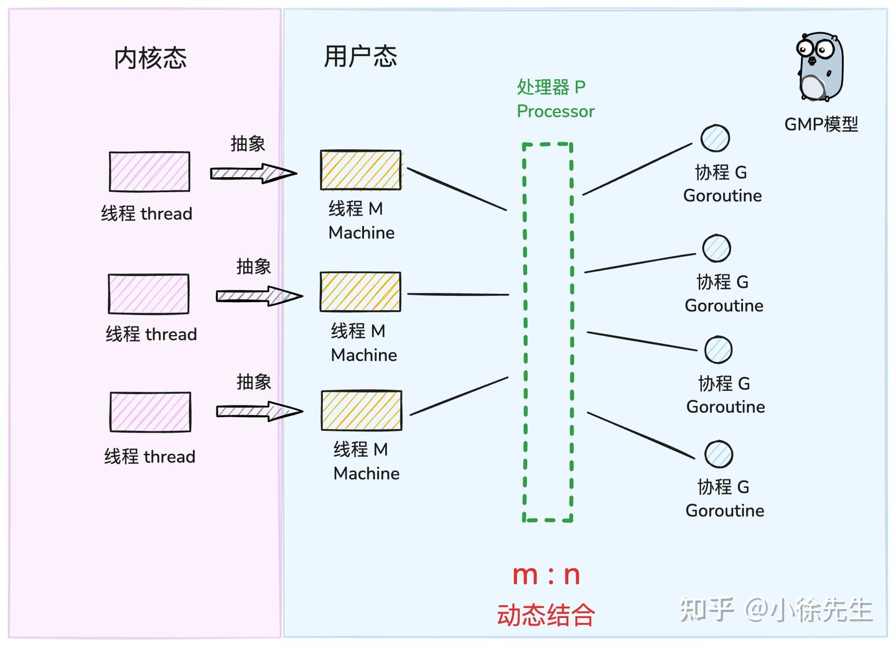
goroutine 是其对协程的本土化实现, golang优化后的特殊协程
+ 与线程存在映射关系，M:N
+ 创建、销毁、调度在用户态完成，对内核透明，足够轻便，弱依赖内核
+ 可利用多个线程，实现并行
+ 调度器实现和线程间的动态绑定
+ 栈空间大小可动态扩缩

#### goroutine相对于原生协程的优势
goroutine其本身是强依附于 gmp（goroutine-machine-processor）体系而生的
+ g 与 p、m 之间可以动态结合，整个调度过程有着很高的灵活性
+ g 栈空间大小可以动态扩缩，既能做到使用方便，也尽可能地节约了资源

## 2. GMP模型
### g
+ g，即 goroutine，是 golang 中对协程的抽象；
+ g 有自己的运行栈、生命周期状态、以及执行的任务函数（用户通过 go func 指定）；
+ g 需要绑定在 m 上执行，在 g 视角中，可以将 m 理解为它的 cpu

gmp 理解为一个任务调度系统，那么 g 就是这个系统中所谓的“任务”，是一种需要被分配和执行的“资源

### m
+ m 即 machine，是 golang 中对线程的抽象；
+ m 需要和 p 进行结合，从而进入到 gmp 调度体系之中
+ m 的运行目标始终在 g0 和 g 之间进行切换——当运行 g0 时执行的是 m 的调度流程，负责寻找合适的“任务”，也就是 g；当运行 g 时，执行的是 m 获取到的”任务“，也就是用户通过 go func 启动的 goroutine
gmp 理解为一个任务调度系统，那么 m 就是这个系统中的”引擎“. 当 m 和 p 结合后，就限定了”引擎“的运行是围绕着 gmp 这条轨道进行的，使得”引擎“运行着两个周而复始、不断交替的步骤——寻找任务（执行g0）；执行任务（执行g）


### p
+ p 即 processor，是 golang 中的调度器；
+ p 可以理解为 m 的执行代理，m 需要与 p 绑定后，才会进入到 gmp 调度模式当中；因此 p 的数量决定了 g 最大并行数量（可由用户通过 GOMAXPROCS 进行设定，在超过 CPU 核数时无意义）
+ p 是 g 的存储容器，其自带一个本地 g 队列（local run queue，简称 lrq），承载着一系列等待被调度的 g

gmp 理解为一个任务调度系统，那么 p 就是这个系统中的”中枢“，当其和作为”引擎“ 的 m 结合后，才会引导“引擎”进入 gmp 的运行模式；同时 p 也是这个系统中存储“任务”的“容器”，为“引擎”提供了用于执行的任务资源.

### 宏观模型


#### 架构分析（存储容器设计）
+ p 的本地队列 lrq（local run queue）：这是每个 p 私有的 g 队列，通常由 p 自行访问，并发竞争情况较少，因此设计为无锁化结构，通过 CAS（compare-and-swap）操作访问
    - 当 m 与 p 结合后，不论是创建 g 还是获取 g，都优先从私有的 lrq 中获取，从而尽可能减少并发竞争行为；这里聊到并发情况较少，但并非完全没有，是因为还可能存在来自其他 p 的窃取行为
+ 全局队列 grq（global run queue）：是全局调度模块 schedt 中的全局共享 g 队列，作为当某个 lrq 不满足条件时的备用容器，因为不同的 m 都可能访问 grq，因此并发竞争比较激烈，访问前需要加全局锁

#### g放入和取出容器
+ put g：当某个 g 中通过 go func(){...} 操作创建子 g 时，会先尝试将子 g 添加到当前所在 p 的 lrq 中（无锁化）；如果 lrq 满了，则会将 g 追加到 grq 中（全局锁）. 此处采取的思路是“就近原则”
+ get g：gmp 调度流程中，m 和 p 结合后，运行的 g0 会不断寻找合适的 g 用于执行，此时会采取“负载均衡”的思路，遵循如下实施步骤
    - 优先从当前 p 的 lrq 中获取 g（无锁化-CAS）
    - 从全局的 grq 中获取 g（全局锁）
    - 取 io 就绪的 g（netpoll 机制）
    - 从其他 p 的 lrq 中窃取 g（无锁化-CAS）

## 3. gmp生态
在 golang 中已经完全屏蔽了线程的概念,将 goroutine 统一为整个语言层面的并发粒度，并遵循着 gmp 的秩序进行运作。gmp理念下的工具案例

### golang的内存管理模块

为每个 p 准备了一份私有的高速缓存——mcache，能够无锁化地完成一部分 p 本地的内存分配操作.

### 并发工具

在 golang 中的并发工具（例如锁 mutex、通道 channel 等）均契合 gmp 作了适配改造，保证在执行阻塞操作时，会将阻塞粒度限制在 g（goroutine）而非 m（thread）的粒度，使得阻塞与唤醒操作都属于用户态行为，无需内核的介入，同时一个 g 的阻塞也完全不会影响 m 下其他 g 的运行.

- 博主近期尝试着使用 c++ 效仿 gmp 实现一套协程调度体系，虽然还原出了其中大部分功能，但在使用上还是存在一个很大的缺陷，就是 c++ 标准库中的并发工具（如 lock、semaphore 等）对应的阻塞粒度都是 thread 级别的，这就导致一个协程（coroutine）的阻塞会上升到线程（thread）级别，并导致其他 goroutine 也丧失被执行的机会.

### io多路复用

在设计 io 模型时，golang 采用了 linux 系统提供的 epoll 多路复用技术，然而为了因为 epoll_wait 操作而引起 m（thread）粒度的阻塞，golang 专门设计一套 netpoll 机制，使用用户态的 gopark 指令实现阻塞操作，使用非阻塞 epoll_wait 结合用户态的 goready 指令实现唤醒操作，从而将 io 行为也控制在 g 粒度，很好地契合了 gmp 调度体系

## 4. gmp核心数据结构
### g详设

```go
// 一个 goroutine 的具象类
type g struct {
	// g 的执行栈空间
	stack       stack   
        /*
            栈空间保护区边界，用于探测是否执行栈扩容
            在 g 超时抢占过程中，用于传递抢占标识
        */
	stackguard0 uintptr 
	// ...
 
        // 记录 g 执行过程中遇到的异常    
	_panic    *_panic 
        // g 中挂载的 defer 函数，是一个 LIFO 的链表结构
	_defer    *_defer 

        // g 从属的 m
	m         *m      
        // ...  
        /*
            g 的状态
            // g 实例刚被分配还未完成初始化
            _Gidle = iota // 0

            // g 处于就绪态.  可以被调度 
            _Grunnable // 1

            // g 正在被调度运行过程中
            _Grunning // 2

            // g 正在执行系统调用
            _Gsyscall // 3

            // g 处于阻塞态，需要等待其他外部条件达成后，才能重新恢复成就绪态
            _Gwaiting // 4

            // 生死本是一个轮回. 当 g 调度结束生命终结，或者刚被初始化准备迎接新生前，都会处于此状态
            _Gdead // 6
        */
        atomicstatus uint32
        // ...
        // 进入全局队列 grq 时指向相邻 g 的 next 指针
        schedlink    guintptr
        // ...
}
```
### m详设

m（machine）是 go 对 thread 的抽象
+ g0：执行调度流程的特殊 g（不由用户创建，是与 m 一对一伴生的特殊 g，为 m 寻找合适的普通 g 用于执行）
+ gsignal：执行信号处理的特殊 g（不由用户创建，是与 m 一对一伴生的特殊 g，处理分配给 m 的 signal）
+ curg：m 上正在执行的普通 g（由用户通过 go func(){...} 操作创建）
+ p：当前与 m 结合的 p
```go
type m struct {
        // 用于调度普通 g 的特殊 g，与每个 m 一一对应
	g0      *g     
	// ...
	// m 的唯一 id
	procid        uint64            
        // 用于处理信号的特殊 g，与每个 m 一一对应
	gsignal       *g              
	// ...
        // m 上正在运行的 g
	curg          *g       
	// m 关联的 p
	p             puintptr 
	// ...
        // 进入 schedt midle 链表时指向相邻 m 的 next 指针 
        schedlink     muintptr
        // ...
}
```
将 m 的运行目标划分为 g0 和 g ，两者是始终交替进行的：g0 就类似于引擎中的调度逻辑，检索任务列表寻找需要执行的任务；g 就是由 g0 找到并分配给 m 执行的一个具体任务.

### p详设

p （processor）是 gmp 中的调度器
+ status：p 生命周期状态
+ m：当前与 p 结合的 m
+ runq：p 私有的 g 队列——local run queue
+ runqhead：lrq 中队首节点的索引
+ runqtail：lrq 中队尾节点的索引
+ runnext：lrq 中的特定席，指向下一个即将执行的 g
```go
type p struct {
	id          int32
        /*
            p 的状态
            // p 因缺少 g 而进入空闲模式，此时会被添加到全局的 idle p 队列中
            _Pidle = iota // 0

            // p 正在运行中，被 m 所持有，可能在运行普通 g，也可能在运行 g0
            _Prunning // 1

            // p 所关联的 m 正在执行系统调用. 此时 p 可能被窃取并与其他 m 关联
            _Psyscall // 2

            // p 已被终止
            _Pdead // 4
        */
	status      uint32 // one of pidle/prunning/...
        // 进入 schedt pidle 链表时指向相邻 p 的 next 指针
	link        puintptr        
	// ...
	// p 所关联的 m. 若 p 为 idle 状态，可能为 nil
	m           muintptr   // back-link to associated m (nil if idle)
	// lrq 的队首
	runqhead uint32
        // lrq 的队尾
	runqtail uint32
        // q 的本地 g 队列——lrq
	runq     [256]guintptr
	// 下一个调度的 g. 可以理解为 lrq 中的特等席
	runnext guintptr
	// ...
}
```

### schedt详设
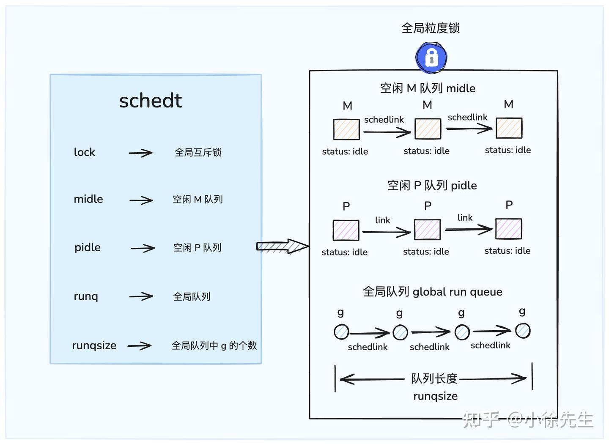
schedt 是全局共享的资源模块，在访问前需要加全局锁：
+ lock：全局维度的互斥锁
+ midle：空闲 m 队列
+ pidle：空闲 p 队列
+ runq：全局 g 队列——global run queue，简称 grq
+ runqsize：grq 中存在的 g 个数
```go
// 全局调度模块
type schedt struct {
	// ...
        // 互斥锁
	lock mutex

	// 空闲 m 队列
	midle        muintptr // idle m's waiting for work
	// ...
        // 空闲 p 队列
	pidle      puintptr // idle p's
	// ...

	// 全局 g 队列——grq
	runq     gQueue
        // grq 中存量 g 的个数
	runqsize int32
	// ...
}
```
之所以存在 midle 和 pidle 的设计，就是为了避免 p 和 m 因缺少 g 而导致 cpu 空转. 对于空闲的 p 和 m，会被集成到空闲队列中，并且会暂停 m 的运行

## 5. gmp的调度流程
所谓调度，指的是一个由用户通过 go func(){...} 操作创建的 g，是如何被 m 上的 g0 获取并执行的，所以简单来说，就是由 g0 -> g 的流转过程.


### g0与g

在每个 m 中会有一个与之伴生的 g0，其任务就是不断寻找可执行的 g. 所以对一个 m 来说，其运行周期就是处在 g0 与 g 之间轮换交替的过程中
```go
type m struct {
        // 用于寻找并调度普通 g 的特殊 g，与每个 m 一一对应
	g0      *g     
        // ...
        // m 上正在运行的普通 g
	curg          *g       
	// ...
}
```
在 m 运行中，能够通过几个桩方法实现 g0 与 g 之间执行权的切换:
g -> g0：mcall、systemstack
g0 -> g：gogo

m 通过 p 调度执行的 goroutine 永远在普通 g 和 g0 之间进行切换，当 g0 找到可执行的 g 时，会调用 gogo 方法，调度 g 执行用户定义的任务；当 g 需要主动让渡或被动调度时，会触发 mcall 方法，将执行权重新交还给 g0.

### 调度类型

#### 1. 主动调度
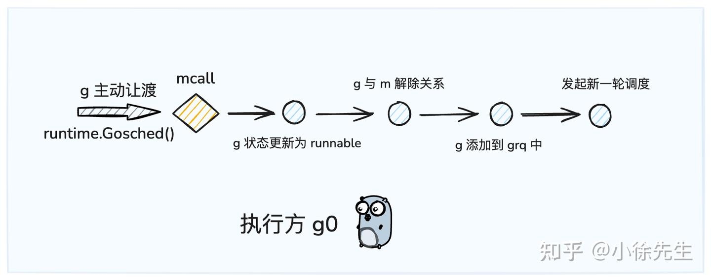
一种用户主动执行让渡的方式，主要方式是由用户手动调用 runtime.Gosched 方法让出 g 所持有的执行权. 在 Gosched 方法中，会通过 mcall 指令切换至 g0，并由 g0 执行 gosched_m 方法
+ 将 g 由 running 改为 runnable 状态
+ 解除 g 和 m 的关系
+ 将 g 直接添加到全局队列 grq 中
+ 调用 schedule 方法发起新一轮调度
```go
// 主动让渡出执行权，此时执行方还是普通 g
func Gosched() {
	// ...
        // 通过 mcall，将执行方转为 g0，调用 gosched_m 方法
	mcall(gosched_m)
}
```
```go
// 将 gp 切换回就绪态后添加到全局队列 grq，并发起新一轮调度
// 此时执行方为 g0
func gosched_m(gp *g) {
	// ...
	goschedImpl(gp)
}

func goschedImpl(gp *g) {
	// ...
        // 将 g 状态由 running 改为 runnable 就绪态
	casgstatus(gp, _Grunning, _Grunnable)
        // 解除 g 和 m 的关系
	dropg()
        // 将 g 添加到全局队列 grq
	lock(&sched.lock)
	globrunqput(gp)
	unlock(&sched.lock)
        // 发起新一轮调度
	schedule()
}
```


#### 2. 被动调度(阻塞让渡)
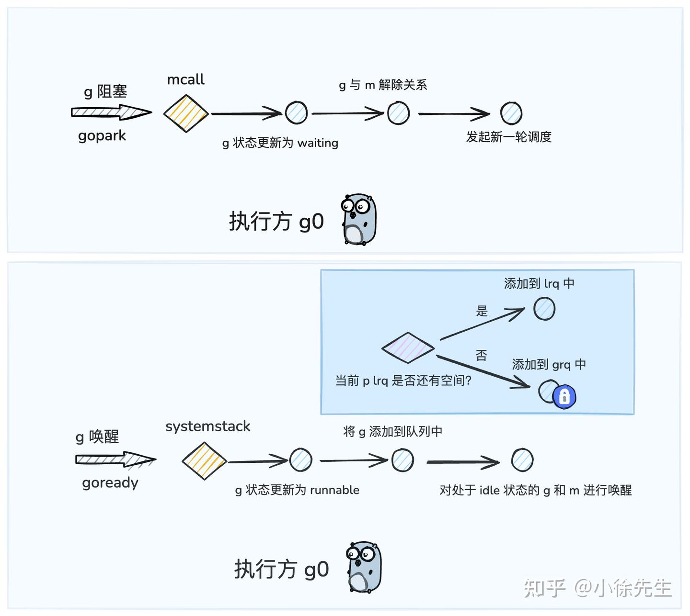
因当前不满足某种执行条件，可能会陷入阻塞态无法被p调度，把当前执行的goroutine由一个running状态切换成waiting状态，直到关注的条件达成后，g才从阻塞中被唤醒，重新进入可执行队列等待被调度（就绪态（runnable））.

常见的被动调度触发方式为因 channel 操作或互斥锁操作陷入阻塞等操作，底层会走进 gopark 方法。由running切换成waiting。底层由mcall机制，将执行权由普通的g交还给当前m的g0，g0实现当前陷入被动阻塞态的goroutine状态切换，从runing状态切换成waiting状态，与调度器p进行解绑。当前g0做完以上动作后，尝试获取下一个可以被执行调度的goroutine

如果陷入被动阻塞的goroutine，唤醒时机到达之后，受goready影响，它对应的状态会在另一个p或某一个p对应的g0过程中，把其他的被动阻塞状态的g， goready 方法通常与 gopark 方法成对出现，能够将 g 从阻塞态中恢复，重新进入等待执行的状态. 从waiting状态切换成runnable状态. 由被动阻塞态中刚刚被唤醒的g0尝试加入到主动执行唤醒动作的p的本地队列中，加入成功的话，可能会优先作为唤醒者的p所调度到

gopark 方法
+ 通过 mcall 从 g 切换至 g0，并由 g0 执行 park_m 方法
+ g0 将 g 由 running 更新为 waiting 状态，然后发起新一轮调度

*在阻塞让渡后，g 不会进入到 lrq 或 grq 中，因为 lrq/grq 属于就绪队列. 在执行 gopark 时，使用方有义务自行维护 g 的引用，并在外部条件就绪时，通过 goready 操作将其更新为 runnable 状态并重新添加到就绪队列中.*

```go
// 此时执行方为普通 g
func gopark(unlockf func(*g, unsafe.Pointer) bool, lock unsafe.Pointer, reason waitReason, traceEv byte, traceskip int) {
        // 获取 m 正在执行的 g，也就是要阻塞让渡的 g
	gp := mp.curg
	// ...
        // 通过 mcall，将执行方由普通 g -> g0
	mcall(park_m)
}

// 此时执行方为 g0. 入参 gp 为需要执行 park 的普通 g
func park_m(gp *g) {
        // 获取 g0 
	_g_ := getg()

	// 将 gp 状态由 running 变更为 waiting
	casgstatus(gp, _Grunning, _Gwaiting)
        // 解绑 g 与 m 的关系
	dropg()

	// g0 发起新一轮调度流程
	schedule()
}
```
gopark 相对的，是用于唤醒 g 的 goready 方法，其中会通过 systemstack 压栈切换至 g0 执行 ready 方法——将目标 g 状态由 waiting 改为 runnable，然后添加到就绪队列中.

```go
// 此时执行方为普通 g. 入参 gp 为需要唤醒的另一个普通 g
func goready(gp *g, traceskip int) {
        // 调用 systemstack 后，会切换至 g0 亚展调用传入的 ready 方法. 调用结束后则会直接切换回到当前普通 g 继续执行. 
	systemstack(func() {
		ready(gp, traceskip, true)
	})

        // 恢复成普通 g 继续执行 ...
}
```

```go
// 此时执行方为 g0. 入参 gp 为拟唤醒的普通 g
func ready(gp *g, traceskip int, next bool) {
	// ...

	// 获取当前 g0
	_g_ := getg()
        // ...
        // 将目标 g 状态由 waiting 更新为 runnable
	casgstatus(gp, _Gwaiting, _Grunnable)
        /*
            1) 优先将目标 g 添加到当前 p 的本地队列 lrq
            2）若 lrq 满了，则将 g 追加到全局队列 grq
        */
	runqput(_g_.m.p.ptr(), gp, next)
        // 如果有 m 或 p 处于 idle 状态，将其唤醒
	wakep()
	// ...
}
```


#### 3. 正常调度
g 中的执行任务已完成，g0 会将当前 g 置为死亡状态，发起新一轮调度.

goroutine执行用户业务的代码逻辑完成，正常回收销毁，通过mcall机制把执行权回归到g0手中，再由g0决定下一步执行哪个goroutine 


#### 4. 抢占让渡
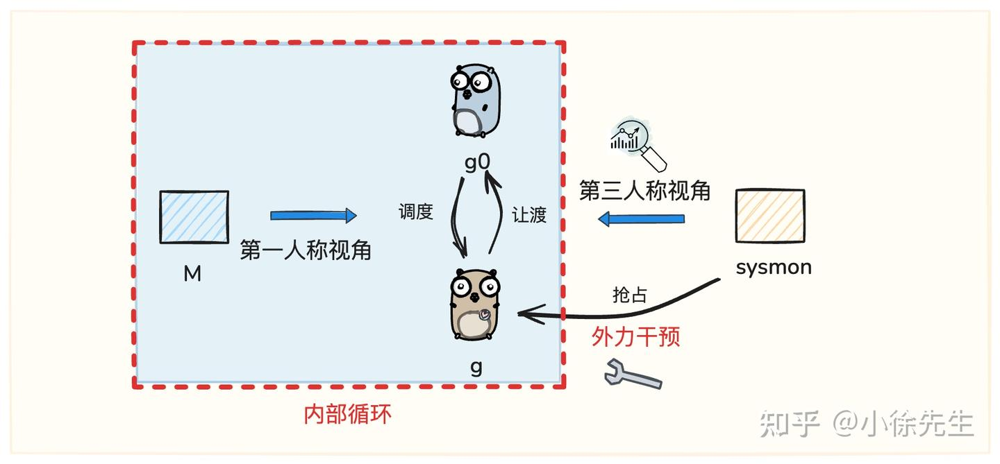
倘若 g 执行系统调用超过指定的时长，且全局的 p 资源比较紧缺，此时将 p 和 g 解绑，抢占出来用于其他 g 的调度. 等 g 完成系统调用后，会重新进入可执行队列中等待被调度.

值得一提的是，前 3 种调度方式都由 m 下的 g0 完成，唯独抢占调度不同.让渡是由 g 主动发起的（第一人称），而抢占则是由外力干预（sysmon thread）发起的（第三人称）.

因为**发起系统调用**时需要打破用户态的边界进入内核态，此时**m 也会因系统调用而陷入僵直**，无法主动完成抢占调度的行为.（m处在不可用状态）


因此，在 Golang 进程会有一个全局监控协程 monitor g 的存在，这个 g 会越过 p 直接与一个 m 进行绑定，不断轮询对所有 p 的执行状况进行监控. 倘若发现满足抢占调度的条件，则会从第三方的角度出手干预，主动发起该动作. （将p与其他的m进行绑定，在进行后续正常调度）

##### 监控线程
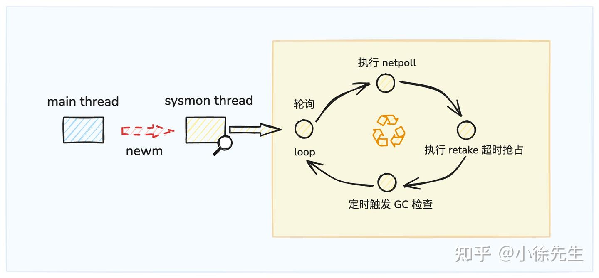
在 go 程序运行时，会启动一个全局唯一的监控线程——sysmon thread，其负责定时执行监控工作
+ 执行 netpoll 操作，唤醒 io 就绪的 g
+ 执行 retake 操作，对运行时间过长的 g 执行抢占操作
+ 执行 gcTrigger 操作，探测是否需要发起新的 gc 轮次
```go
// The main goroutine.
func main() {
	systemstack(func() {
		newm(sysmon, nil, -1)
	})
	// ...
}

func sysmon() {
	// ..

	for {
		// 根据闲忙情况调整轮询间隔，在空闲情况下 10 ms 轮询一次
		usleep(delay)

		// ...
                // 执行 netpoll 
		lastpoll := int64(atomic.Load64(&sched.lastpoll))
		if netpollinited() && lastpoll != 0 && lastpoll+10*1000*1000 < now {
			// ...
			list := netpoll(0) // non-blocking - returns list of goroutines
			// ...
		}
		
                // 执行抢占工作
		retake(now)

                // ...

		// 定时检查是否需要发起 gc
		if t := (gcTrigger{kind: gcTriggerTime, now: now}); t.test() && atomic.Load(&forcegc.idle) != 0 {
			// ...
		}
		// ...
	}
}
```

##### 系统调用
系统调用是 m（thread）粒度的，在执行期间会导致整个 m 暂时不可用，所以此时的抢占处理思路是，将发起 syscall 的 g 和 m 绑定，但是解除 p 与 m 的绑定关系，使得此期间 p 存在和其他 m 结合的机会
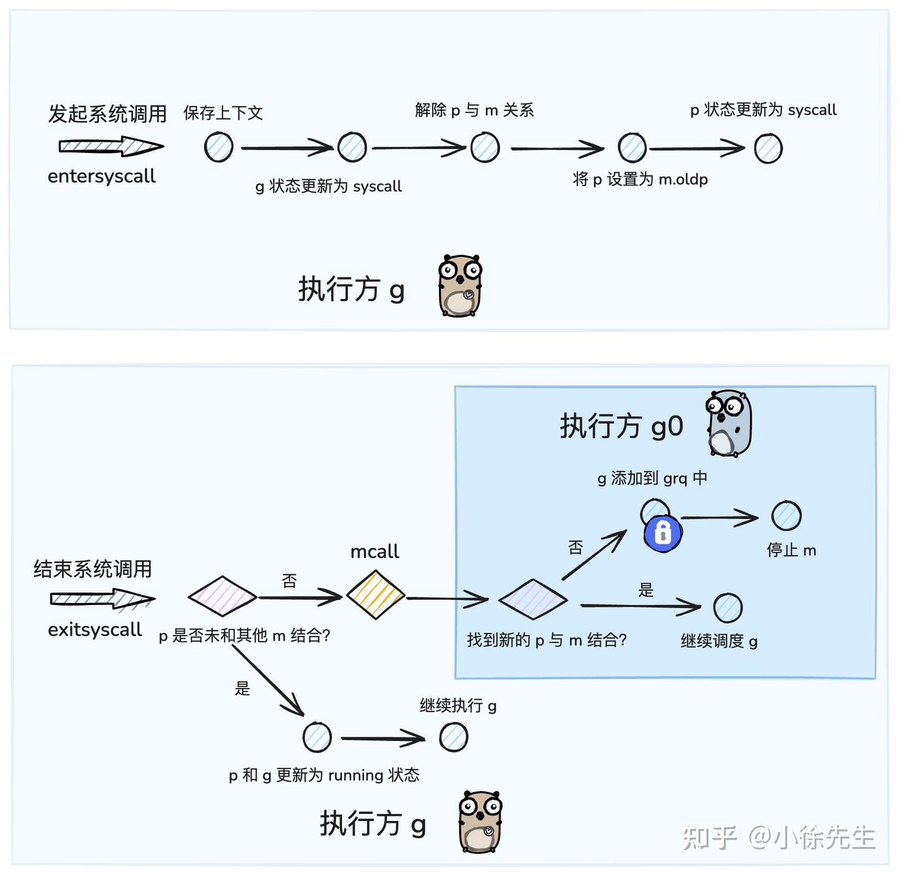


在发起系统调用时，此方法核心步骤包括：
+ 将 g 和 p 的状态更新为 syscall
+ 解除 p 和 m 的绑定
+ 将 p 设置为 m.oldp，保留 p 与 m 之间的弱联系（使得 m syscall 结束后，还有一次尝试复用 p 的机会）

```go
func reentersyscall(pc, sp uintptr) {
        // 获取 g
	_g_ := getg()

        // ...
	// 保存寄存器信息
	save(pc, sp)
	// ...
        // 将 g 状态更新为 syscall
	casgstatus(_g_, _Grunning, _Gsyscall)
	// ...
        // 解除 p 与 m 绑定关系
	pp := _g_.m.p.ptr()
	pp.m = 0
        // 将 p 设置为 m 的 oldp
	_g_.m.oldp.set(pp)
	_g_.m.p = 0
        // 将 p 状态更新为 syscall
	atomic.Store(&pp.status, _Psyscall)
	// ...
}
```
当系统系统调用完成时，会执行位于 runtime/proc.go 的 exitsyscall 方法（此时执行方还是 m 上的 g）
+ 检查 syscall 期间，p 是否未和其他 m 结合，如果是的话，直接复用 p，继续执行 g
+ 通过 mcall 操作切换至 g0 执行 exitsyscall0 方法——尝试为当前 m 结合一个新的 p，如果结合成功，则继续执行 g，否则将 g 添加到 grq 后暂停 m

```go
func exitsyscall() {
        // 获取 g
	_g_ := getg()

	// ...

	// 如果 oldp 没有和其他 m 结合，则直接复用 oldp
	oldp := _g_.m.oldp.ptr()
	_g_.m.oldp = 0
	if exitsyscallfast(oldp) {
		// ...
                // 将 g 状态由 syscall 更新回 running
		casgstatus(_g_, _Gsyscall, _Grunning)
	        // ...

		return
	}

	// 切换至 g0 调用 exitsyscall0 方法
	mcall(exitsyscall0)
        // ...
}
```
```go
// 此时执行方为 m 下的 g0
func exitsyscall0(gp *g) {
        // 将 g 的状态修改为 runnable 就绪态
	casgstatus(gp, _Gsyscall, _Grunnable)
        // 解除 g 和 m 的绑定关系
	dropg()
	lock(&sched.lock)
        // 尝试寻找一个空闲的 p 与当前 m 结合
	var _p_ *p
	_p_, _ = pidleget(0)
	var locked bool
        // 如果与 p 结合失败，则将 g 添加到全局队列中
	if _p_ == nil {
		globrunqput(gp)
		// ...
	} 
        // ...
	unlock(&sched.lock)
        // 如果与 p 结合成功，则继续调度 g 
	if _p_ != nil {
		acquirep(_p_)
		execute(gp, false) // Never returns.
	}
	// ...
        // 与 p 结合失败的话，需要将当前 m 添加到 schedt 的 midle 队列并停止 m
	stopm()
        // 如果 m 被重新启用，则发起新一轮调度
	schedule() // Never returns.
}
```
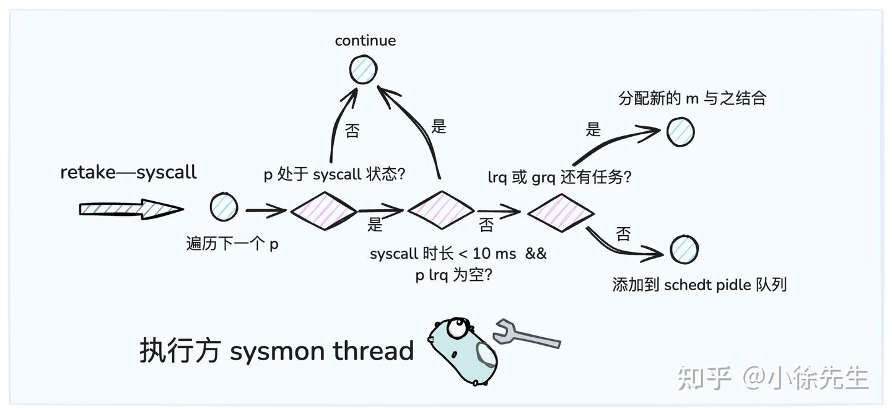
会遍历每个 p，并针对正在发起系统调用的 p 执行如下检查逻辑：

+ 检查 p 的 lrq 中是否存在等待执行的 g
+ 检查 p 的 syscall 时长是否 >= 10ms

但凡上述条件满足其一，就会执行对 p 执行抢占操作（handoffp）——分配一个新的 m 与 p 结合，完成后续任务的调度处理.
```go
func retake(now int64) uint32 {
	n := 0
	// 加锁
	lock(&allpLock)
	// 遍历所有 p
	for i := 0; i < len(allp); i++ {
		_p_ := allp[i]
		// ...
		s := _p_.status
		// ...
                // 对于正在执行 syscall 的 p
		if s == _Psyscall {
			// 如果 p 本地队列为空且发起系统调用时间 < 10ms，则不进行抢占
			// 相对系统是比较清闲的状态
			if runqempty(_p_) && atomic.Load(&sched.nmspinning)+atomic.Load(&sched.npidle) > 0 && pd.syscallwhen+10*1000*1000 > now {
				continue
			}
			unlock(&allpLock)
			// 将 p 的状态由 syscall 更新为 idle
			if atomic.Cas(&_p_.status, s, _Pidle) {
				// ...
                                // 让 p 拥有和其他 m 结合的机会
				handoffp(_p_)
			}
			// ...
			lock(&allpLock)
		}
	}
	unlock(&allpLock)
	return uint32(n)
}


func handoffp(_p_ *p) {
	// 如果 p lrq 中还有 g 或者全局队列 grq 中还有 g，则立即分配一个新 m 与该 p 结合
	if !runqempty(_p_) || sched.runqsize != 0 {
                // 分配一个 m 与 p 结合
		startm(_p_, false)
		return
	}
	// ...
        // 若系统空闲没有 g 需要调度，则将 p 添加到 schedt 中的空闲 p 队列 pidle 中
	pidleput(_p_, 0)
	// ...
}
```
##### 运行超时
除了系统调用抢占之外，当 sysmon thread 发现某个 g 执行时间过长时，也会对其发起抢占操作.
1. 发起抢占

在 retake 方法中，会检测到哪些 p 中运行一个 g 的时长超过了 10 ms，然后对其发起抢占操作（preemtone）
```go
func retake(now int64) uint32 {
	// ...
	for i := 0; i < len(allp); i++ {
		_p_ := allp[i]
		// ...
		if s == _Prunning {
                        // ... 
                        // 如果某个 p 下存在运行超过 10 ms 的 g ，需要对 g 进行抢占
                        if pd.schedwhen+forcePreemptNS <= now{
                               preemptone(_p_)
                        }
		}
		// ...
	}
	// ...
}
```
preemtone 方法中：

+ 会对目标 g 设置抢占标识（将 stackguard0 标识设置为 stackPreempt），这样当 g 运行到检查点时，就会配合抢占意图，自觉完成让渡操作
+ 会对目标 g 所在的 m 发送抢占信号 sigPreempt，通过改写 g 程序计数器（pc，program counter）的方式将 g 逼停
```go
// 抢占指定 p 上正在执行的 g
func preemptone(_p_ *p) bool {
        // 获取 p 对应 m
	mp := _p_.m.ptr()
	// 获取 p 上正在执行的 g（抢占目标）
	gp := mp.curg
	// ...
	/*
            启动协作式抢占标识
            1) 将抢占标识 preempt 置为 true
            2）将 g 中的 stackguard0 标识置为 stackPreempt
            3）g 查看到抢占标识后，会配合主动让渡 p 调度权
        */
        gp.preempt = true
	gp.stackguard0 = stackPreempt

	// 基于信号机制实现非协作式抢占
	if preemptMSupported && debug.asyncpreemptoff == 0 {
		_p_.preempt = true
		preemptM(mp)
	}
        // ...
}
```
在 preemptM 方法中，会通过 tkill 指令向进程中的指定 thread 发送抢占信号 sigPreempt
```go
func preemptM(mp *m) {
	// ...
	if atomic.Cas(&mp.signalPending, 0, 1) {
		if GOOS == "darwin" || GOOS == "ios" {
			atomic.Xadd(&pendingPreemptSignals, 1)
		}

		// 向指定的 m 发送抢占信号
                // const sigPreempt untyped int = 16
		signalM(mp, sigPreempt)
	}
	// ...
}

func signalM(mp *m, sig int) {
	pthread_kill(pthread(mp.procid), uint32(sig))
}
```

2. 协作式抢占
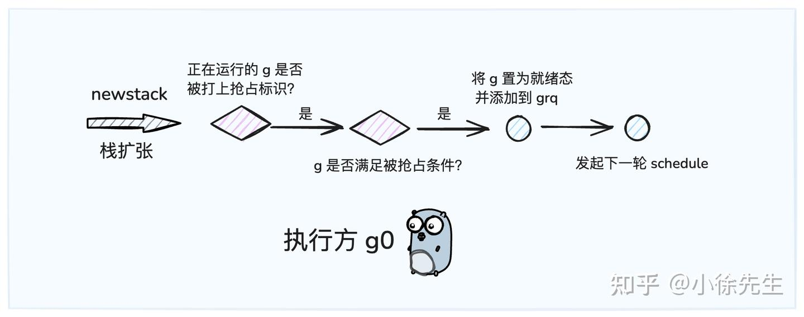
对于运行中的 g，在栈空间不足时，会切换至 g0 调用 newstack 方法执行栈空间扩张操作，在该流程中预留了一个检查桩点，当其中发现 g 已经被打上抢占标记时，就会主动配合执行让渡操作
```go
// 栈扩张. 执行方为 g0
func newstack() {
	// ...
        // 获取当前 m 正在执行的 g
	gp := thisg.m.curg
        // ...
        // 读取 g 中的 stackguard0 标识位
	stackguard0 := atomic.Loaduintptr(&gp.stackguard0)
        // 若 stackguard0 标识位被置为 stackPreempt，则代表需要对 g 进行抢占
	preempt := stackguard0 == stackPreempt
	// ...
        if preempt{
                // 若当前 g 不具备抢占条件，则继续调度，不进行抢占
                // 当持有锁、在进行内存分配或者显式禁用抢占模式时，则不允许对 g 执行抢占操作
		if !canPreemptM(thisg.m) {
			// ...
			gogo(&gp.sched) // never return
		}
        }

     
	if preempt {
		// ...

		// 响应抢占意图，完成让渡操作
		gopreempt_m(gp) // never return
	}

	// ...
}

// gopreempt_m 方法会走到 goschedImpl 方法中，后续流程与 4.2 小节中介绍的主动让渡类似
func gopreempt_m(gp *g) {
	// ...
	goschedImpl(gp)
}

func goschedImpl(gp *g) {
	// ...
	casgstatus(gp, _Grunning, _Grunnable)
	dropg()
	lock(&sched.lock)
	globrunqput(gp)
	unlock(&sched.lock)

	schedule()
}
```
这种通过预留检查点，由 g 主动配合抢占意图完成让渡操作的流程被称作协作式抢占，其存在的局限就在于，当 g 未发生栈扩张行为时，则没有触碰到检查点的机会，也就无法响应抢占意图


3. 非协作式抢占

为了弥补协作式抢占的不足，go 1.14 中引入了基于信号量实现的非协作式抢占机制


#### 5. 结束让渡
##### goexit0() 函数
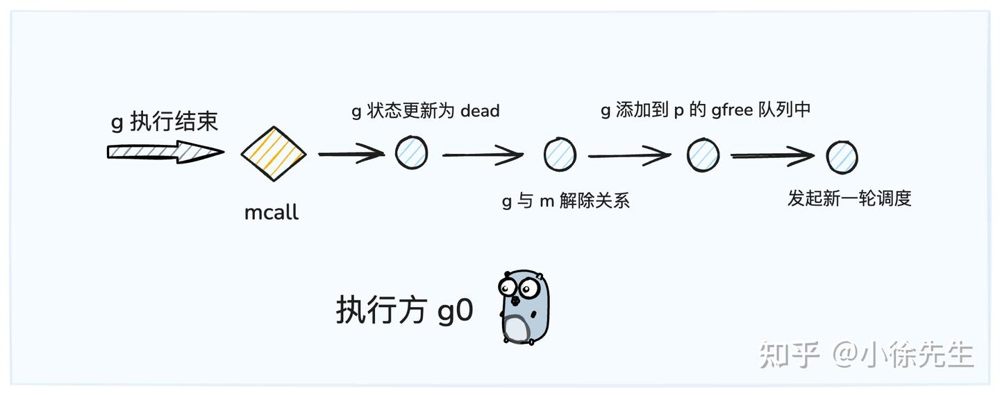

当 g 执行结束时，会正常退出，并将执行权切换回到 g0.

g 在运行结束时会调用 goexit1 方法中，并通过 mcall 指令切换至 g0，由 g0 调用 goexit0 方法，并由 g0 执行下述步骤

+ 将 g 状态由 running 更新为 dead
+ 清空 g 中的数据
+ 解除 g 和 m 的关系
+ 将 g 添加到 p 的 gfree 队列以供复用
+ 调用 schedule 方法发起新一轮调度

```go
// goroutine 运行结束. 此时执行方是普通 g
func goexit1() {
	// 通过 mcall，将执行方转为 g0，调用 goexit0 方法
	mcall(goexit0)
}

// 此时执行方为 g0，入参 gp 为已经运行结束的 g
func goexit0(gp *g) {
        // 获取 g0
	_g_ := getg()
        // 获取对应的 p
	_p_ := _g_.m.p.ptr()

        // 将 gp 的状态由 running 更新为 dead
	casgstatus(gp, _Grunning, _Gdead)
	// ...
   
        // 将 gp 中的内容清空
	gp.m = nil
	// ...
	gp._defer = nil // should be true already but just in case.
	gp._panic = nil // non-nil for Goexit during panic. points at stack-allocated data.
	// ...
        // 将 g 和 p 解除关系
	dropg()
        // ...
        // 将 g 添加到 p 的 gfree 队列中
        gfput(_p_, gp)
	// ...
        // 发起新一轮调度流程
	schedule()
}
```


### 宏观调度流程

+ 以 g0 -> g -> g0 的一轮循环为例进行串联
+ g0 执行 schedule() 函数，寻找到用于执行的 g；
+ g0 执行 execute() 方法，更新当前 g、p 的状态信息，并调用 gogo() 方法，将执行权交给 g；
+ g 因主动让渡( gosche_m() )、被动调度( park_m() )、正常结束( goexit0() )等原因，调用 m_call 函数，执行权重新回到 g0 手中；
+ g0 执行 schedule() 函数，开启新一轮循环.

#### schedule() 函数
schedule 函数，此时的执行权位于 g0 手中
```go
func schedule() {
    // ...
    gp, inheritTime, tryWakeP := findRunnable() // blocks until work is available
    // ...
    execute(gp, inheritTime)
}
```
schedule：调用 findRunnable 方法，获取到可执行的 g
execute：更新 g 的上下文信息，调用 gogo 方法，将 m 的执行权由 g0 切换到 g

#### findRunnable() 函数
findRunnable 方法中如何按照指定的策略获取到可执行的 g.
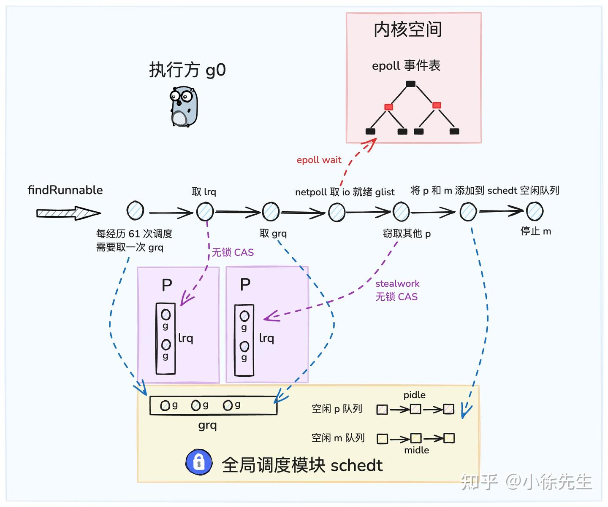

+ 每经历 61 次调度后，需要先处理一次全局队列 grq（globrunqget——加锁），避免产生饥饿；
+ 尝试从本地队列 lrq 中获取 g（runqget——CAS 无锁）
+ 尝试从全局队列 grq 获取 g（globrunqget——加锁）
+ 尝试获取 io 就绪的 g（netpoll——非阻塞模式）
+ 尝试从其他 p 的 lrq 窃取 g（stealwork）
+ double check 一次 grq（globrunqget——加锁）
+ 若没找到 g，将 p 置为 idle 状态，添加到 schedt pidle 队列（动态缩容）
+ 确保留守一个 m，监听处理 io 就绪的 g（netpoll——阻塞模式）
+ 若 m 仍无事可做，则将其添加到 schedt midle 队列（动态缩容）
+ 暂停 m（回收资源）

```go
// 获取可用于执行的 g. 如果该方法返回了，则一定已经找到了目标 g. 
func findRunnable() (gp *g, inheritTime, tryWakeP bool) {
        // 获取当前执行 p 下的 g0
	_g_ := getg()
	// ...

top:
        // 获取 p
	_p_ := _g_.m.p.ptr()
	// ...
	// 每 61 次调度，需要尝试处理一次全局队列 (防止饥饿)
	if _p_.schedtick%61 == 0 && sched.runqsize > 0 {
		lock(&sched.lock)
		gp = globrunqget(_p_, 1)
		unlock(&sched.lock)
		if gp != nil {
			return gp, false, false
		}
	}

	// ...
	// 尝试从本地队列 lrq 中获取 g
	if gp, inheritTime := runqget(_p_); gp != nil {
		return gp, inheritTime, false
	}

	// 尝试从全局队列 grq 中获取 g
	if sched.runqsize != 0 {
		lock(&sched.lock)
		gp := globrunqget(_p_, 0)
		unlock(&sched.lock)
		if gp != nil {
			return gp, false, false
		}
	}

	// 执行 netpoll 流程，尝试批量唤醒 io 就绪的 g 并获取首个用以调度
	if netpollinited() && atomic.Load(&netpollWaiters) > 0 && atomic.Load64(&sched.lastpoll) != 0 {
		if list := netpoll(0); !list.empty() { // non-blocking
			gp := list.pop()
			injectglist(&list)
			casgstatus(gp, _Gwaiting, _Grunnable)
			// ...
			return gp, false, false
		}
	}

        // ...
	// 从其他 p 的 lrq 中窃取 g
	gp, inheritTime, tnow, w, newWork := stealWork(now)
	if gp != nil {
		return gp, inheritTime, false
	}

	// 若存在 gc 并发标记任务，则以 idle 模式参与协作，好过直接回收 p
        // ...

	// 加全局锁，并 double check 全局队列是否有 g
	lock(&sched.lock)
	// ...
	if sched.runqsize != 0 {
		gp := globrunqget(_p_, 0)
		unlock(&sched.lock)
		return gp, false, false
	}
	// ... 
        // 确认当前 p 无事可做，则将 p 和 m 解绑，并将其添加到全局调度模块 schedt 中的空闲 p 队列 pidle 中 
        // 解除 m 和 p 的关系
        releasep()
        // 将 p 添加到 schedt.pidle 中
	now = pidleput(_p_, now)
	unlock(&sched.lock)

	// ...
	// 在 block 当前 m 之前，保证全局存在一个 m 留守下来，以阻塞模式执行 netpoll，保证有 io 就绪事件发生时，能被第一时间处理
	if netpollinited() && (atomic.Load(&netpollWaiters) > 0 || pollUntil != 0) && atomic.Xchg64(&sched.lastpoll, 0) != 0 {
		atomic.Store64(&sched.pollUntil, uint64(pollUntil))
		// ...
                // 以阻塞模式执行 netpoll 流程
		delay := int64(-1)
		// ...
		list := netpoll(delay) // block until new work is available
               
		// 恢复 lastpoll 标识
		atomic.Store64(&sched.lastpoll, uint64(now))
		// ...
		lock(&sched.lock)

                // 从 schedt 的空闲 p 队列 pidle 中获取一个空闲 p
		_p_, _ = pidleget(now)
		unlock(&sched.lock)
                // 若没有获取到 p，则将就绪的 g 都添加到全局队列 grq 中
		if _p_ == nil {
			injectglist(&list)
		} else {
                        // m 与 p 结合
			acquirep(_p_)
                        // 将首个 g 直接用于调度，其余的添加到全局队列 grq
			if !list.empty() {
				gp := list.pop()
				injectglist(&list)
				casgstatus(gp, _Gwaiting, _Grunnable)
				// ...
				return gp, false, false
			}
			// ...
			goto top
		}
	}
        // ...
        // 走到此处仍然未找到合适的 g 用于调度，则需要将 m block 住，添加到 schedt 的 midle 中
	stopm()
	goto top
}
```

1. 从 lrq获取 g

2. 从全局队列获取 g
+ globrunqget 方法用于从全局的 grq 中获取 g. 调用时需要确保持有 schedt 的全局锁

3. 获取 io 就绪的 g
+ 在 gmp 调度流程中，如果 lrq 和 grq 都为空，则会执行 netpoll 流程，尝试以非阻塞模式下的 epoll_wait 操作获取 io 就绪的 g

4. 从其他 p 窃取 g
+ 如果执行完 netpoll 流程后仍未获得 g，则会尝试从其他 p 的 lrq 中窃取半数 g 补充到当前 p 的 lrq 中
        - stealWork 
```go
func stealWork(now int64) (gp *g, inheritTime bool, rnow, pollUntil int64, newWork bool) {
	// 获取当前 p
        pp := getg().m.p.ptr()
        // ...
        // 外层循环 4 次
	const stealTries = 4
	for i := 0; i < stealTries; i++ {
		// ...
                // 通过随机数以随机起点随机步长选取目标 p 进行窃取
		for enum := stealOrder.start(fastrand()); !enum.done(); enum.next() {
			// ...
                        // 获取拟窃取的目标 p
			p2 := allp[enum.position()]
                        // 如果目标 p 是当前 p，则跳过
			if pp == p2 {
				continue
			}

			// ...
			// 只要目标 p 不为 idle 状态，则进行窃取
			if !idlepMask.read(enum.position()) {
                                // 窃取目标 p，其中会尝试将目标 p lrq 中半数 g 窃取到当前 p 的 lrq 中
				if gp := runqsteal(pp, p2, stealTimersOrRunNextG); gp != nil {
					return gp, false, now, pollUntil, ranTimer
				}
			}
		}
	}

	// 窃取失败 未找到合适的目标
	return nil, false, now, pollUntil, ranTimer
}
```
为保证窃取行为的公平性，遍历的起点是随机的，窃取动作的核心逻辑位于rungrab方法中

5. 回收空闲的 p 和 m
+ 如果直到最后都没有找到合适的 g 用于执行，则需要将 p 和 m 添加到 schedt 的 pidle 和 midle 队列中并停止 m 的运行，避免产生资源浪费

#### execute() 函数
```go
// 执行给定的 g. 当前执行方还是 g0，但会通过 gogo 方法切换至 gp
func execute(gp *g, inheritTime bool) {
	// 获取 g0
        _g_ := getg()
	// ...
        /*
            建立 m 和 gp 的关系
            1）将 m 中的 curg 字段指向 gp
            2）将 gp 的 m 字段指向当前 m
        */
	_g_.m.curg = gp
	gp.m = _g_.m

        // 更新 gp 状态 runnable -> running
	casgstatus(gp, _Grunnable, _Grunning)
	// ...
        // 设置 gp 的栈空间保护区边界
	gp.stackguard0 = gp.stack.lo + _StackGuard
	// ...
        // 执行 gogo 方法，m 执行权会切换至 gp
	gogo(&gp.sched) // gogo方法，执行goroutine中的任务
}
```

